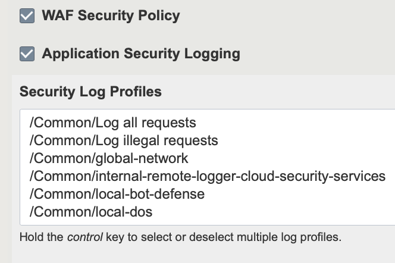
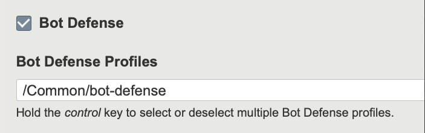

.. _asm:

Appendix F: ASM Guidance (WAF Security Policy)
==============================================

F5 BIG-IP FAST supports bot defense, rapid deployment and security logging for Application Security Manager (ASM/WAF) policies.

What is ASM
-----------

ASM is a web application firewall that secures web applications and protects them from vulnerabilities. 
ASM also helps to ensure compliance with key regulatory mandates. 
The browser-based user interface provides network device configuration, centralized security policy management, and easy-to-read audit reports.

Provisioning ASM
----------------

Before you begin, ASM must be licensed and provisioned on the BIG-IP. See `K12111: Provisioning licensed BIG-IP modules <https://support.f5.com/csp/article/K12111>`_

Using WAF Security Policy
-------------------------

Once ASM is provisioned, and you are running BIG-IP v14.1 or greater, a section for WAF and Application Security Logging will appear in the following bigip-fast-templates: HTTP, HTTPS, TCP, UDP, LDAP, IIS, Sharepoint, SMTP and DNS.

A selection box containing the Security Log Profiles from /Common will be available to choose the applicable Profile(s).
Holding *ctrl* will allow for multiple policy selection.

BOT Defense Profiles
--------------------

In FAST, if the **WAF Security Policy** option is checked, the **BOT Defense Profiles** checkbox and profile list are hidden as they cannot be used on the same virtual server. 
By unchecking **WAF Security Policy**, BIG-IP FAST can assign a Bot Defense Profile using the ProfileBotDefense BIG-IP AS3 property of the Service_HTTP class.

**Note:** ProfileBotDefense does not work with BIG-IP version prior to v14.1.

|
| The table below outlines each template and their corresponding security policy.
|
.. list-table::
      :widths: 30 80 
      :header-rows: 1

   
      * - Template
        - Security Policy
    
      * - HTTP
        - Bot defense, WAF Policy, Logging

      * - HTTPS
        - Bot defense, WAF Policy, Logging

      * - TCP
        - Bot defense, WAF Policy, Logging
    
      * - IIS
        - Bot defense, WAF Policy, Logging

      * - Sharepoint
        - Bot defense, WAF Policy, Logging

      * - DNS
        - WAF Policy, Logging
    
      * - LDAP
        - WAF Policy, Logging

      * - SMTP
        - WAF Policy, Logging

      * - UDP
        - Logging

.. seealso:: Manual : For a more in depth explanation of WAF, see `K28426659: What is a WAF? <https://support.f5.com/csp/article/K28426659>`_
       

