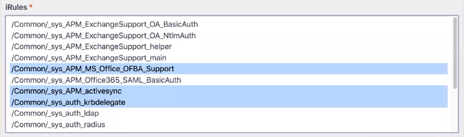

.. _advanced:

Appendix B: Advanced Features
=============================

.. _base64:

Base64 Encoding
---------------

| Using the GUI, FAST has the ability to encode template parameters as base64, which becomes part of the template output (AS3 declaration).  
| iRules are a common use case, however AS3 supports base64 for a wide range of objects.
|

In the following example, *base64var* will display as editable plain text but render as base64-encoded text:

.. code-block:: yaml

   contentType: application/json
   definitions:
       base64var:
           type: string
           format: text
           contentEncoding: base64
           default: ZmRhZWVhZWZl # will display as plain text in the GUI
   template: |
     {
       "data": {{base64var}}
     }

.. seealso:: `AS3 Schema Reference <https://clouddocs.f5.com/products/extensions/f5-appsvcs-extension/latest/refguide/schema-reference.html>`_ for a full list of **f5base64** fields.

.. _enum:

Enumerated Type
----------------------

An *Enumerated Type (enum)* is a list of constant values.  
In order for the property to be valid, it must match an item in the list of values.
As it relates to BIG-IP, it is a mechanism to pull data from the BIG-IP *(enumFromBigip)* presenting it as an *enum*.  

An example usage would be to create drop-down lists.  
The path on BIG-IP: ``/mgmt/tm/${enumFromBigip}?$select=fullPath``

.. seealso:: BIG-IP :ref:`endpoint-list` for a list of BIG-IP endpoints.

.. _conttype:

ContentTypes
------------
When FAST renders it is doing string replacement via Mustache, which is agnostic to the output type. 
However, specifying a *contentType* in the template can enable some additional features:

*	Post-processing steps (e.g., strip dangling commas for JSON)
*	Smarter merges
*	Smarter handling of some data types

    .. NOTE:: Since FAST relies on AS3 for templating, a *contentType* of *application/json* should be declared indicating that the body format is JSON. 
        See `What is the correct JSON Content Type <https://stackoverflow.com/questions/477816/what-is-the-correct-json-content-type>`_ for additional information.

.. _multichoice:

Multiple Choice Lists
---------------------

While authoring a template, it is possible to specify multiple choice list boxes for use in cases such as iRules.

Some requirements must be met, which are:

* type must be *array*
* uniqueItems must be *true*
* items must have an *enum*

An example for generating a multi-select list box for iRules would be:

.. code-block:: yaml

    contentType: application/json             
    definitions:                                                                                                           
        irules:                                            
            type: array                                                                     
            uniqueItems: true                                                                  
            items:          
                type: string                              
                enumFromBigip: ltm/rule                      
     template: |                                                          
       {                                                                        
        "irules": {{irules::array}}                                                                   
       }   

.. _schemagui:

Schema-driven GUI
-----------------

Generating a GUI is done by passing data to a libary called *JSON Editor*. 
JSON supports *formats* for schema of type *string*. 

Example of a *password* object.

.. code-block:: json

  {
    "type": "object",
    "properties": {
      "password": {
        "type": "string",
        "format": "password"
      }
    }
  }

.. NOTE::  If property *enum* is specified, type *format* is ignored.

Using type *format: info* allows for adding titles and descriptions.  For example:
::

    help_stuff:
      title: This template configures BIG-IP devices.
      description: A BIG-IP is an application proxy.
      format: info

.. seealso::  `JSON Editor: format <https://github.com/json-editor/json-editor#format>`_ for additional information and input types.

.. _httpcall:

HTTP Calls to External Resources
--------------------------------

| Some template parameters may be sourced from other places, such as external APIs or databases.
|

| A *Template.fetchHttp()* method does an HTTP request for each parameter definition that has a *url* property returning a parameter object with the response results. The value used from a response can be altered by specifying a *JSONPath* query in an optional pathQuery property of the parameter definition. *url* can also be an object matching Node's *http.request()* options object.
|

.. code-block:: yaml

   type: object
   properties:
     url:
       description: HTTP resource to call to fetch data.
         oneOf:
           - type: string
           - type: object # looks like Node request options
     pathQuery:
       type: string
       description: JSONPath of data to be fetched, must match schema
