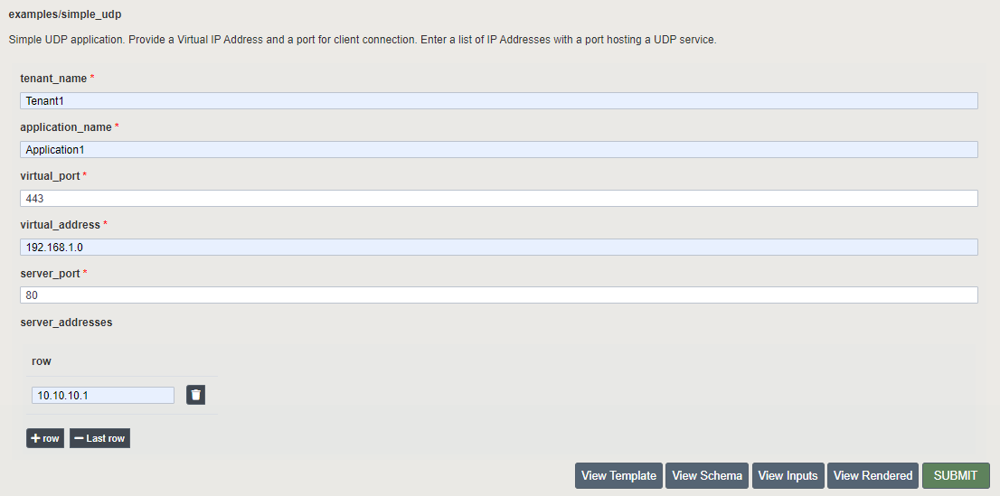
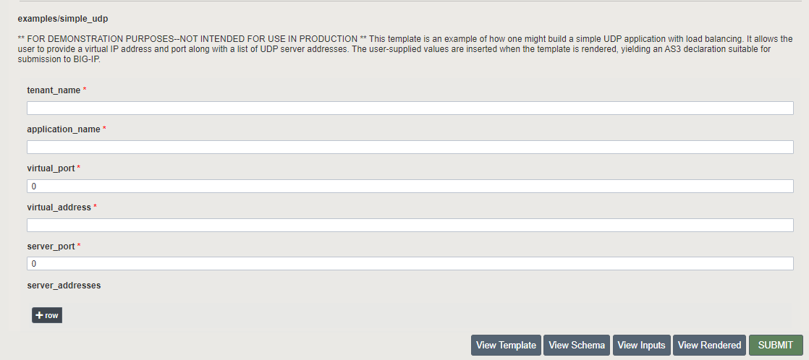

Deploying an F5 BIG-IP FAST Application 
=======================================

Deploy using the GUI
--------------------

| From the BIG-IP, Launch FAST from **iApps > Application Services > Applications LX.**
| You will be presented with 5 tabs, select **FAST Templates** for a new deployment, or **Applications** to redeploy an application.

For this example we are using **examples/simple_udp.** Fields noted with an asterisk * are required.

| 1. Enter a Tenant Name. The *tenant* is the high-level grouping in an AS3 declaration. BIG-IP FAST deploys all configuration for a given tenant in a BIG-IP partition of the same name.
| 2. Enter an Application Name. The *application* is the low-level grouping in an AS3 declaration. BIG-IP FAST deploys all configuration for a given application in a BIG-IP folder within the tenant partition.
| 3. Enter the virtual_port.
| 4. Enter the virtual_address.
| 5. Enter the server_port.
| 6. Enter a server_address for each server. This field is not required.
|
See the image below for example field entries.

From the Debug View buttons, select View Rendered to display a sample of the rendered output of the template.

|
| Clicking on Deploy will start a deployment job.
| The current status of the job can be found on the *History* tab.

Deploy using the BIG-IP FAST API
--------------------------------

BIG-IP FAST also exposes a REST API for programmability and automation.
The basics of working with REST APIs is assumed and will not be covered in this document.

The same **examples/simple_udp** deployment from the above GUI example can be done via a *POST* to the `mgmt/shared/fast/applications` endpoint.
Using cURL to do this would look like:

   .. code-block:: shell

      curl -sku <BIG-IP username>:<BIG-IP password> -H "Content-Type: application/json" -X POST https://<IP address of BIG-IP>/mgmt/shared/fast/applications -d ' 
      { 
         "name": "examples/simple_http", 
         "parameters": { 
            "tenant_name": "Tenant1", 
            "application_name": "Application1", 
            "virtual_port": 443, 
            "virtual_address": "192.168.1.0", 
            "server_port": 80, 
            "server_addresses": ["10.10.10.1"] 
         } 
      }'

This job is asynchronous and a successful response indicates that the task was submitted, not that it completed successfully.
The response payload contains an `id` that can be used to query `mgmt/shared/fast/tasks/<task ID>` for the current status of the task.

.. seealso:: :ref:`api-ref` for a reference of the BIG-IP FAST REST API.
